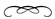

{: .center.omit}

---

Now is the 
end come. 
We are returned 
to the ancient 
beginning.
{: .top}

Here, 
where Truth is restored, 
we look with gentleness 
upon the world.

---

You are here only to be 
truly helpful. 
Yet 
you do not know 
what needs to be done.
{: .top}

Would you know 
your Father's will for you?

Precious friend, 
open the eyes of your Self; 
it will not be hidden 
from you.

---

Where does the
servant go,  awakened to the eternal?  "Here,"  comes the
quiet reply.
{: .top}

---

Because *you* 
are awake *here* 
and your sister 
is awake *here*, 
though bodies are 
seemingly separate, 
there is not two, 
but one.
{: .top}

---

Pray 
fast, 
meditate. 
Journey into the silent places 
of your precious Earth, 
for she alone is your mother.
{: .top}

Sing, 
laugh, 
dance, 
play.

Drink the first rays of a new dawn. 
Touch the dark velvet 
of a moonless night. 
Feel the grasses against your skin, 
and stand beneath 
the cascading waterfall.

Give but one day of your week 
to silence, 
eating only the Light 
from your Father.

---

Smile often, 
and remember 
you have chosen to come, 
*here*. 
Look around you, 
and bless the place you are. 
Do these things often, 
in remembrance of me.
{: .top}

---

I AM
{: .iam}

with
{: .i1}

you
{: .i2}

always &hellip;
{: .i3}

